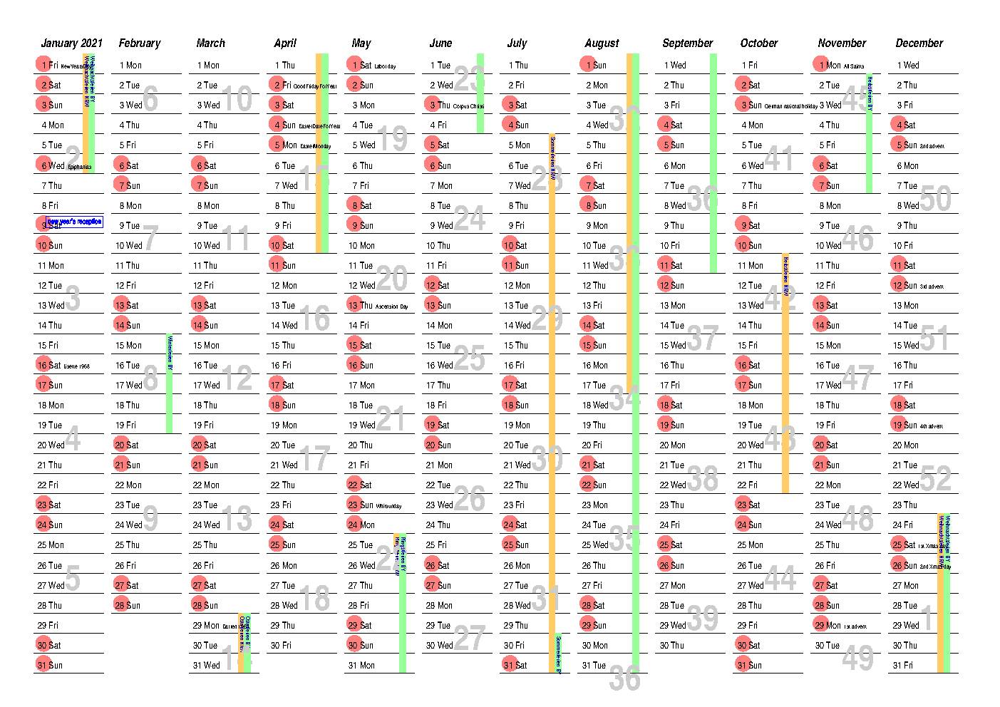

# Postscript Calendar

This Postscript file prints the calendar of one year on a sheet of paper.
It does all the date calculations for Easter and other public holidays.
The calendar can be customized to show birthdays, school vacations, and other day marks.

Additionally, there's a shell script `makepdf.sh` that converts the Postscript file to a PDF file
or a PNG file using [Ghostscript](https://www.ghostscript.com/).

As most printers understand straight Postscript,
no additional calculations or translations are required -- the printer does it all!

## Motivation

The calendar was created to have a simple planning sheet for the year.
I've been using it for this for more than 25 years now.

## Dependencies

To render the Postscript file to PDF or PNG using `makepdf.sh`,
[Ghostscript](https://www.ghostscript.com/) is required.
I used [ImageMagick](https://www.imagemagick.org/) to rotate the PNG.
